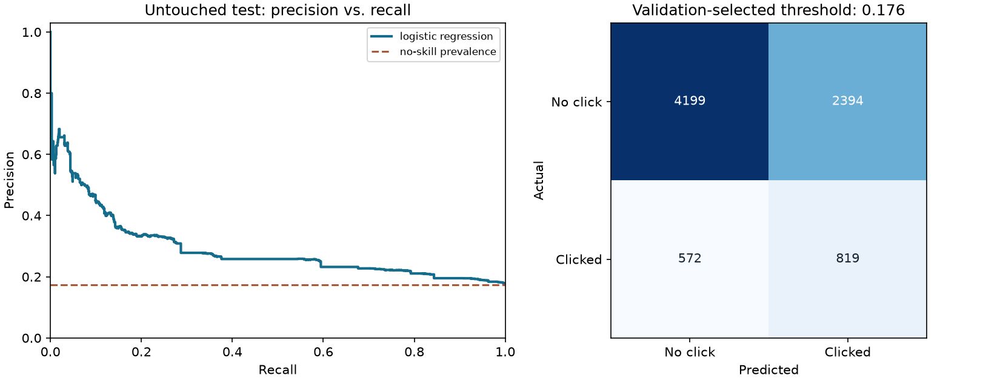

# Click Through Rate / Click Propensity — reproducible results

Predict whether an ad was clicked using Tencent/KDD Cup 2012 data distributed as OpenML dataset 1220. The supplied 39,948-row subset is explicitly downsampled by its publisher. Use depth, position, and categorical ad/query attributes available when selecting an ad; exclude post-event view counts, click timestamps, and aggregate impression counts. Known users are kept in one partition, and identical anonymous contexts are grouped together.

## Evaluation design

Seed 42. Training, validation, and test row counts: 23,957,
7,985, 7,984.
Preprocessing is fitted inside the training pipeline. Model selection uses validation
log_loss; the decision threshold maximizes validation F1.
The selected model is **logistic_regression**. No tuning uses the test labels.

## Untouched test results

| Measure | Selected model | Constant-prevalence baseline |
|---|---:|---:|
| Average precision | 0.2890 | 0.1742 |
| ROC AUC | 0.6475 | 0.5000 |
| Log loss (lower is better) | 0.4397 | 0.4626 |
| Brier score (lower is better) | 0.1370 | 0.1439 |
| Precision | 0.2549 | 0.0000 |
| Recall | 0.5888 | 0.0000 |
| F1 | 0.3558 | 0.0000 |
| Accuracy | 0.6285 | 0.8258 |

At threshold **0.1756**, the model produces **3,213** positive flags:
**819** true positives and **2,394** false positives.
It misses **572** positives; **4,199** negatives are correctly rejected.
Test positive prevalence is **17.42%**, across 7,984 rows.

## Interpretation and limits

Model selection minimizes validation log loss because the task needs useful click-propensity scores, rather than recall obtained by flagging almost every impression. The F1-selected threshold is a demonstration decision rule, not an ad-serving policy. `ranking_lift.csv` shows the observed clicks captured within fixed ranking budgets on the untouched test set. Upstream negative downsampling changes prevalence: predicted scores and observed rates describe this benchmark, not a campaign's actual CTR. No timestamp is supplied, so temporal drift remains untested. The original receipt-ad MySQL data is unavailable; this benchmark is a replacement and does not reproduce the historical notebook's 93% recall claim. Production CTR requires representative impression logs, calibration on natural prevalence, and a time-based holdout.

See [all candidate metrics](metrics.csv), [auditable test predictions](predictions.csv),
[split assignments](splits.csv), and [run metadata, input hash, and package versions](metrics.json).
Numbers here are generated by the script, not copied from the historical notebook.
