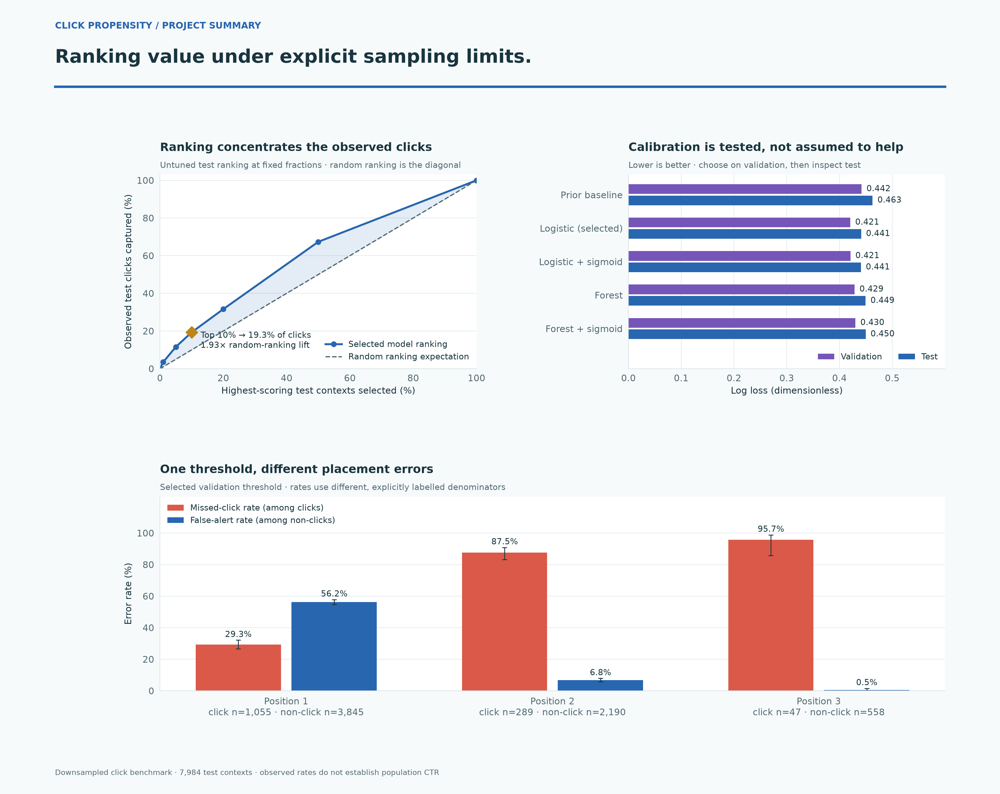
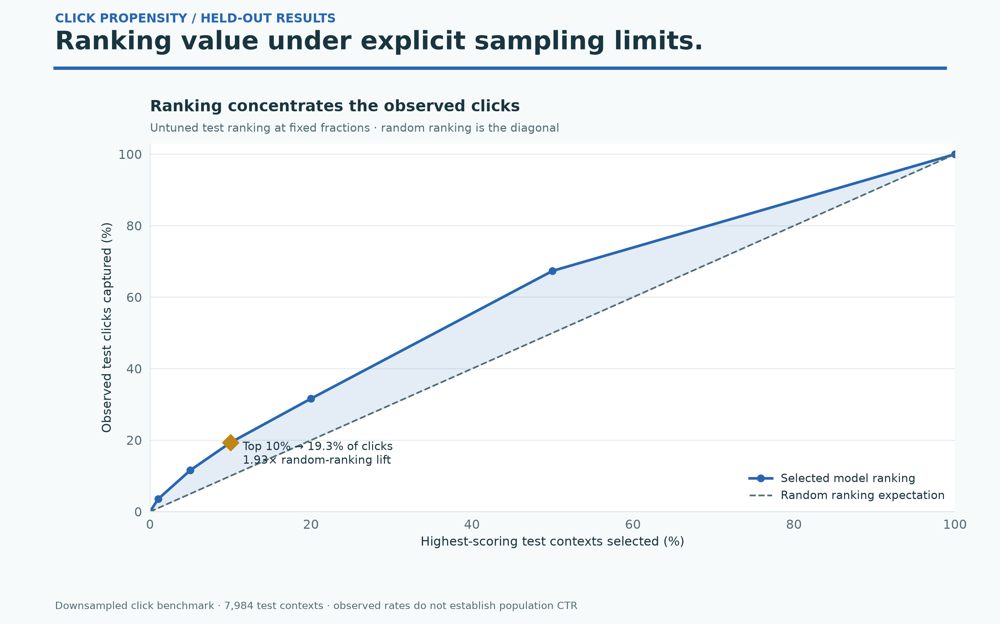
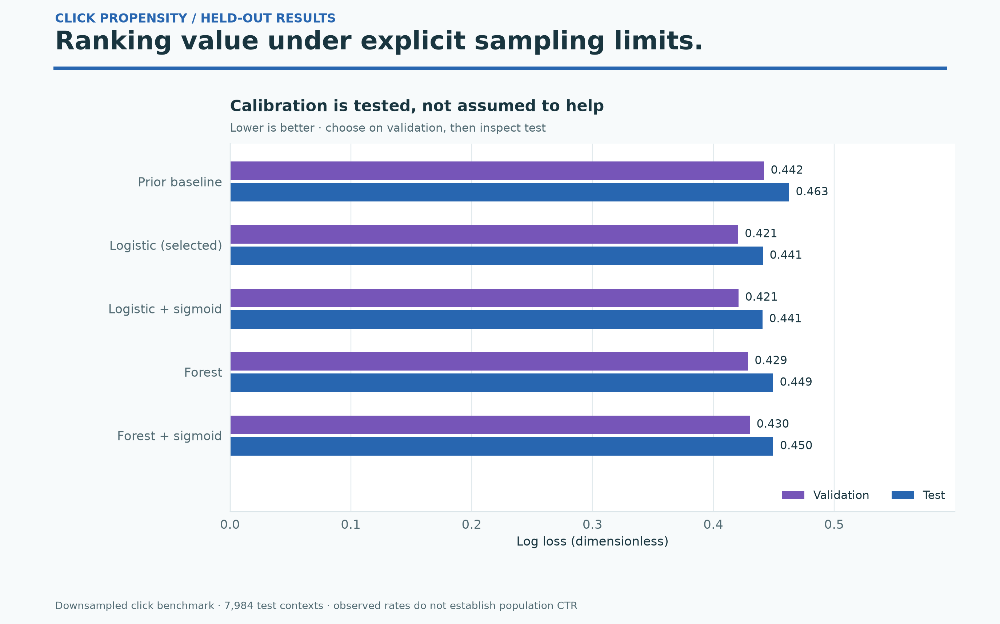
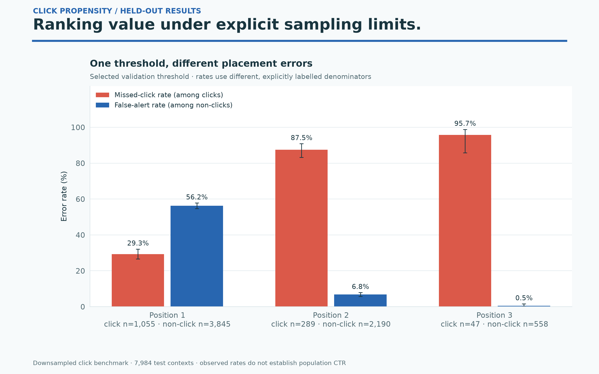

# Click propensity — colorful results gallery

Ranking value under explicit sampling limits.

Downsampled click benchmark · 7,984 test contexts · observed rates do not establish population CTR



High-resolution PNGs and editable SVGs come from saved phase-two results. No model was retrained and no data was downloaded. These are descriptive benchmark results; model and policy choices were fixed on validation.

## Ctr Gains

Fractions were set in advance; no test-based threshold selection. Rates and lift describe the downsampled benchmark, not natural campaign CTR.



[PNG](ctr_gains.png) · [SVG](ctr_gains.svg)

## Ctr Model Loss

Probabilities describe the sampled benchmark. Small differences cannot restore unknown population prevalence, and no statistical superiority is inferred.



[PNG](ctr_model_loss.png) · [SVG](ctr_model_loss.svg)

## Ctr Position Errors

Whiskers are Wilson 95% row intervals, not clustered campaign inference. These descriptive position associations do not establish a causal placement effect.



[PNG](ctr_position_errors.png) · [SVG](ctr_position_errors.svg)

## Reproduce

```bash
python plot_gallery.py
```

Use the pinned project requirements. Sources and hashes are in [chart-provenance.json](chart-provenance.json). Original phase-two outputs are unchanged.
